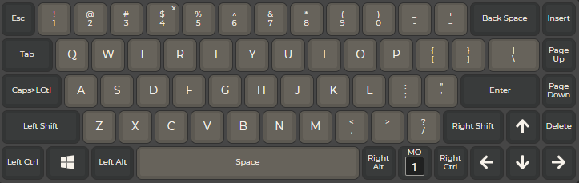
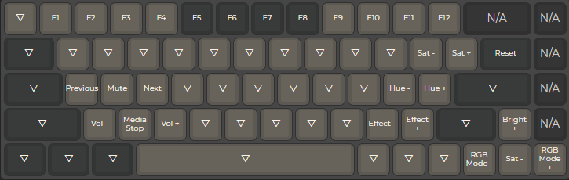
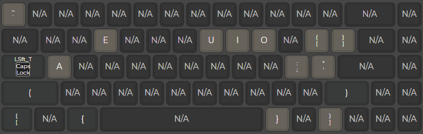

# Isaac's DZ65RGBv3 Layout

This layout fit best people who mainly type in English but regularly need to type in Spanish _(using an English keyboard in OS setting)_. There are also some Leader Key bindings/macros designed to work on both Mac and Windows OS.

### Disclaimer

Mostly of the programming was made from Drootz, you can find the original repo [here](https://github.com/qmk/qmk_firmware/tree/master/keyboards/dztech/dz65rgb/keymaps/drootz).

- [LAYERS](#LAYERS)
- [LEADER KEY BINDINGS:](#LEADER-KEY-BINDINGS)
  - [OS and Keyboard Macros](#OS-and-Keyboard-Macros)
  - [Spanish Accents](#Spanish-Accents)
  - [Special Characters and Punctuation](#Special-Characters-and-Punctuation)
  - [Expanded Space Cadet Macros](#Expanded-Space-Cadet-Macros)
- [STEP BY STEP FLASH INSTRUCTIONS](#STEP-BY-STEP-FLASH-INSTRUCTIONS)
- [TODO List](#TODO-LIST)

## HIGH LEVEL DESCRIPTION

#### Dual function Capslock key

- Single tap to trigger the Leader Key
- Double tap to toggle Capslock ON/OFF

#### 70+ useful Leader Key bindings and macros

- "Designed" to work on both Mac and Windows OS with an English keyboard OS setting
- Per key timing set at 425ms. Never a key sequence!
- 20+ Punctuation, ASCII, System shortcuts and macros
- Spanish accents (á, é, í, ó)
  - No need to switch languague input in the SO currently using
  - Preserve Capslock if enabled
- Text "selection" shortcuts
- 20+ Expanded "Space Cadet" feature with Shift, Ctrl, Alt and DoubleQuote for (), [], {} and ""

#### Less RGB effects due shortage of memory

In total of 10+ lighting effects fully customizable using the \_FN layer with hue, saturation, brightness and speed.

- Matrix Splash => Full gradient & value pulse away from a single key hit then fades value out
- Solid Splash => Hue & value pulse away from a single key hit then fades value out
- Solid Color => Static single hue, no speed support

#### LED indicators and animations

- White led when Capslock toggle ON
- White LED indicator in the layer \_FN for available keys to use (i.e media controls or RGB customization)
- Leader Key LED indicator:
  - Persistent 50% dimmed under-glow on top right corner key
  - Light up at 100% for the duration of the Leader Key timeout when activated
  - Hue, saturation and brightness can be globally adjusted with the RGB matrix settings on layer \_FN

#### 2 Layers

- \_MAIN: Default layer
- \_FN: Functions & settings layer:
  - F Keys (F1...F12) on number row
  - RGB matrix & animation settings
  - Media & volume control

## LAYERS

- Press down and hold the MO(\_FN) key to access the \_FN layer
- Double tap on the Capslock key to toggle Capslock ON/OFF
- \_TRNS (∇ symbol) keys use the next lowest non-transparent key (on lower layers)
- N/A keys are ignored (nothing happens)

### [Layer 1: \_MAIN](previews/layer1.png)

### [Layer 2: \_FN](previews/layerfn.png)

## LEADER KEY BINDINGS

The Leader Key on this layout is triggered by tapping the Capslock key once. Once triggered, we have 450ms between each key press to type any one of the sequences listed below. All sequences are designed to work on both Mac and Windows with an English keyboard OS setting.

- [OS and Keyboard Macros](#OS-and-Keyboard-Macros)
- [Spanish Accents](#Spanish-Accents)
- [Special Characters and Ponctuation](#Special-Characters-and-Ponctuation)
- [Text Selection Macros](#Text-Selection-Macros)
- [Expanded Space Cadet Macros](#Expanded-Space-Cadet-Macros)
- [Text Expanders](#Text-Expanders)

#### Legend:

| Acronym | Description          |
| :------ | :------------------- |
| LDR     | Leader Key           |
| SFT     | Shift key            |
| CTL     | Control key          |
| ESC     | Escape key           |
| ¶       | Text cursor position |

### OS and Keyboard Macros

| Output                                               | Sequence                  | Description                                |
| :--------------------------------------------------- | :------------------------ | :----------------------------------------- |
| Toggle Capslock                                      | `LDR LDR`                 | Single tap Capslock to trigger the LDR key |
| Delete all previous characters in word on cursor OR; | `LDR BACKSPACE`           | n/a                                        |
| => Delete previous word if triggered repeatedly      | `LDR BACKSPACE`           | n/a                                        |
| Delete all forward characters in word on cursor OR;  | `LDR DEL`                 | n/a                                        |
| => Delete next word if triggered repeatedly          | `LDR DEL`                 | n/a                                        |
| Backward Delete whole word on cursor                 | `LDR BACKSPACE BACKSPACE` | n/a                                        |
| Forward Delete whole word on cursor                  | `LDR DEL DEL`             | n/a                                        |
| Printscreen                                          | `LDR INSERT`              | n/a                                        |
| Home                                                 | `LDR PAGE-UP`             | n/a                                        |
| End                                                  | `LDR PAGE-DOWN`           | n/a                                        |

### Spanish Accents

| Output                               | Sequence | Description                                      |
| :----------------------------------- | :------- | :----------------------------------------------- |
| `à`¶ &nbsp;&nbsp;or&nbsp;&nbsp; `À`¶ | `LDR A`  | Will output upper character if Capslock enabled. |
| `é`¶ &nbsp;&nbsp;or&nbsp;&nbsp; `É`¶ | `LDR E`  | Will output upper character if Capslock enabled  |
| `ó`¶ &nbsp;&nbsp;or&nbsp;&nbsp; `Ó`¶ | `LDR O`  | Will output upper character if Capslock enabled. |
| `ú`¶ &nbsp;&nbsp;or&nbsp;&nbsp; `Ú`¶ | `LDR U`  | Will output upper character if Capslock enabled. |

### Special Characters and Punctuation

| Output    | Sequence          | Description                                      |
| :-------- | :---------------- | :----------------------------------------------- |
| `ñ`¶      | `LDR N`           | Will output upper character if Capslock enabled. |
| `` ` `` ¶ | `LDR ESC`         | n/a                                              |
| \`\`\` ¶  | `LDR ESC ESC ESC` | n/a                                              |

### Expanded Space Cadet Macros

| Output           | Sequence                  | Description                                        |
| :--------------- | :------------------------ | :------------------------------------------------- |
| `"`¶             | `LDR '`                   | Will output single double-quote                    |
| `"`¶`"`          | `LDR ' '`                 | Will wrap cursor between two double-quotes         |
| `"`WORD`"`¶      | `LDR ' ' '`               | Will wrap word on cursor between two double-quotes |
| `(`¶             | `LDR LEFT-SFT`            | Will output single left parenthesis                |
| `)`¶             | `LDR RIGHT-SFT`           | Will output single right parenthesis               |
| `(`¶`)`          | `LDR LEFT-SFT LEFT-SFT`   | Will wrap cursor between two parenthesis'          |
| `(`¶`)`          | `LDR RIGHT-SFT RIGHT-SFT` | Will wrap cursor between two parenthesis'          |
| `(`WORD`)`¶      | `LDR LEFT-SFT W`          | Will wrap word on cursor between two parenthesis'  |
| `(`WORD`)`¶      | `LDR RIGHT-SFT W`         | Will wrap word on cursor between two parenthesis'  |
| `(`SELECTION`)`¶ | `LDR LEFT-SFT W W`        | Will wrap selection between two parenthesis'       |
| `(`SELECTION`)`¶ | `LDR RIGHT-SFT W W`       | Will wrap selection between two parenthesis'       |
| `[`¶             | `LDR LEFT-CTL`            | Will output single left bracket                    |
| `]`¶             | `LDR RIGHT-CTL`           | Will output single right bracket                   |
| `[`¶`]`          | `LDR LEFT-CTL LEFT-CTL`   | Will wrap cursor between two brackets'             |
| `[`¶`]`          | `LDR RIGHT-CTL RIGHT-CTL` | Will wrap cursor between two brackets'             |
| `[`WORD`]`¶      | `LDR LEFT-CTL W`          | Will wrap word on cursor between two brackets'     |
| `[`WORD`]`¶      | `LDR RIGHT-CTL W`         | Will wrap word on cursor between two brackets'     |
| `[`SELECTION`]`¶ | `LDR LEFT-CTL W W`        | Will wrap selection between two brackets'          |
| `[`SELECTION`]`¶ | `LDR RIGHT-CTL W W`       | Will wrap selection between two brackets'          |
| `{`¶             | `LDR LEFT-ALT`            | Will output single left curly brace                |
| `}`¶             | `LDR RIGHT-ALT`           | Will output single right curly brace               |
| `{`¶`}`          | `LDR LEFT-ALT LEFT-ALT`   | Will wrap cursor between two curly braces'         |
| `{`¶`}`          | `LDR RIGHT-ALT RIGHT-ALT` | Will wrap cursor between two curly braces'         |
| `{`WORD`}`¶      | `LDR LEFT-ALT W`          | Will wrap word on cursor between two curly braces' |
| `{`WORD`}`¶      | `LDR RIGHT-ALT W`         | Will wrap word on cursor between two curly braces' |
| `{`SELECTION`}`¶ | `LDR LEFT-ALT W W`        | Will wrap selection between two curly braces'      |
| `{`SELECTION`}`¶ | `LDR RIGHT-ALT W W`       | Will wrap selection between two curly braces'      |

## STEP BY STEP FLASH INSTRUCTIONS

1. In case it is required to modify the layout you need to paste all the files into the `qmk_firmware` folder and replace all the files in that are inside the drootz' original repo that is in: `qmk_firmware\keyboards\dztech\dz65rgb\keymaps\drootz`

2. Build the Firmware. Run build command in directory: `make dztech/dz65rgb/v3:drootz`

   - Approximate firmware size: 27302/28672 (95%, 1370 bytes free) _(need to check after the addition of the spanish accents and special characters)_

3. Flash the Firmware:
   - Open QMK Toolbox Application
   - Open firmware file: dztech_dz65rgb_v2_drootz.hex
   - Unplug keyboard USB, and hold the ESC key while plugging it back in
   - Check that QMK Toolbox displays: \*\*\* DFU device connected.
   - Hit the flash button
   - Wait until the QMK Toolbox prompts: Eject Device Now
   - Enjoy!

## TODO List

- [ ] Add Spanish accent with the `LDR` and each vocal
- [ ] Add the `ñ` "special" letter
- [ ] Reduce the memory used in the code
